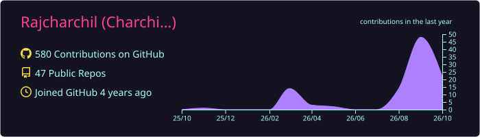
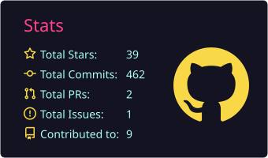
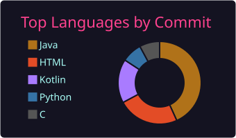
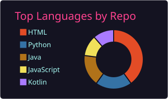
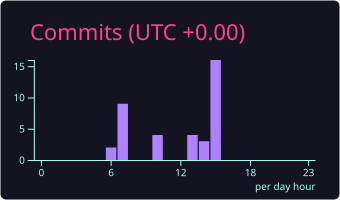
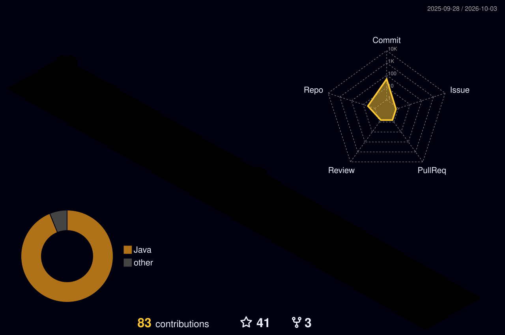

<!-- ═══════════════ HEADER ═══════════════ -->
<p align="center">
  
</p>

<p align="center">
  
</p>

<p align="center">
  
  <a href="https://github.com/rajcharchil?tab=followers"></a>
  
</p>

<p align="center">
  <a href="mailto:rajcharchil555@gmail.com"></a>
  <a href="https://instagram.com/charchil_cr11" target="_blank"></a>
  <a href="https://github.com/rajcharchil"></a>
</p>


<!-- ═══════════════ ABOUT ═══════════════ -->
<h2 align="center">👨‍💻 About Me</h2>

<table align="center" width="100%">
<tr>
<td width="55%" valign="top">

```yaml
name: Charchil
location: India 🇮🇳
role: Software Developer & Tester
currently_working_on:
  - Android testing
  - Mobile / Web testing
currently_learning: AI & ML 🧠
looking_to: Collaborate with passionate programmers
need_help_with: AI/ML development
ask_me_about: [Android, Software Testing]
reach_me_at: rajcharchil555@gmail.com
```

</td>
<td width="45%" valign="middle">

🔭 Working on **Android and mobile/web testing**

🌱 Learning **AI & ML** to build smarter applications

👯 Looking to collaborate with **passionate programmers**

🤝 Seeking help with **AI/ML development**

💬 Ask me about **Android** or **Software Testing**

</td>
</tr>
</table>

<details>
<summary><b>⚡ Click for a fun fact</b></summary>
<br>

> 🦠 **The first computer virus was created in 1986!**

</details>

<!-- ═══════════════ TECH STACK ═══════════════ -->
<h2 align="center">🛠️ Languages & Tools</h2>

<p align="center">
  
</p>

<div align="center">

| 📱 Mobile | 🧪 Testing | 💻 Languages | ☁️ Backend & Cloud | 🎨 3D |
|:---:|:---:|:---:|:---:|:---:|
| Android | Selenium / Appium | C · C++ · Java | Node.js | Blender |
| Kotlin | Mobile / Web QA | JS · Python | MySQL · AWS | |

</div>


<!-- ═══════════════ GITHUB STATS (self-generated by GitHub Actions) ═══════════════ -->
<h2 align="center">📊 GitHub Stats</h2>

<p align="center">
  
</p>

<p align="center">
  
  
</p>

<p align="center">
  
  
</p>

<p align="center">
  
</p>

<!-- ═══════════════ 3D CONTRIBUTIONS ═══════════════ -->
<h2 align="center">🧊 3D Contribution Graph</h2>

<p align="center">
  
</p>

<!-- ═══════════════ SNAKE ═══════════════ -->
<h2 align="center">🐍 Contribution Snake</h2>

<p align="center">
  <picture>
    <source media="(prefers-color-scheme: dark)" srcset="https://raw.githubusercontent.com/rajcharchil/rajcharchil/output/github-snake-dark.svg" />
    <source media="(prefers-color-scheme: light)" srcset="https://raw.githubusercontent.com/rajcharchil/rajcharchil/output/github-snake.svg" />
    
  </picture>
</p>

<!-- ═══════════════ FOOTER ═══════════════ -->
<p align="center">
  
</p>

<p align="center">
  
</p>
